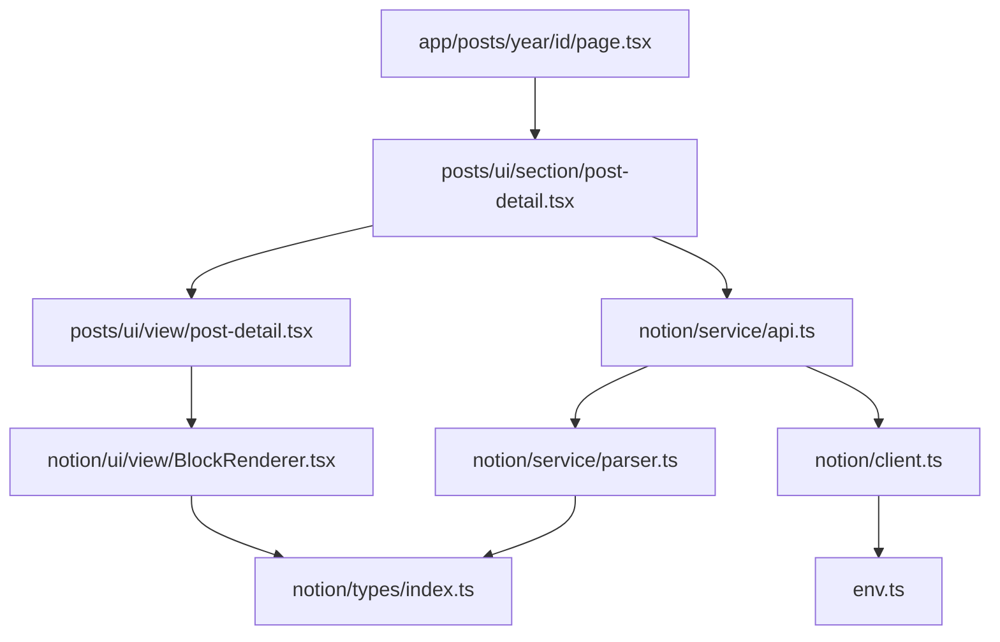

# 包括的リファクタリング計画書

プロジェクト: Tallahassee (Notion散文投稿サイト)
分析日: 2026-01-24
技術スタック: Next.js 16, React 19, TypeScript, Biome

---

## エグゼクティブサマリー

コードベース全体を分析した結果、全体的に良好な構造を持っていますが、以下の主要な改善機会が特定されました:

1. **Cache Components最適化** (優先度: 高) - Next.js 16の"use cache"ディレクティブが部分的にしか活用されていない
2. **コード重複の削減** (優先度: 高) - NotionブロックとAPIレスポンスのパース処理に重複がある
3. **型安全性の向上** (優先度: 中) - より厳密な型定義が可能な箇所が複数存在
4. **未使用コードの削除** (優先度: 中) - Knipが7つの未使用ファイルと複数の未使用依存関係を検出
5. **パフォーマンス最適化** (優先度: 中) - Imageコンポーネントの最適化、バンドルサイズ削減の機会

---

## 1. コード品質の評価

### 1.1 複雑度が高いファイル

#### /src/modules/notion/service/api.ts (171行)

**問題点**:
- 3つの類似した関数 (`getPosts`, `getPost`, `getPostsByYear`) で重複したロジック
- 5つの小さな抽出関数がファイル内に分散
- データ変換ロジックがAPI層に混在

**影響**: 保守性低下、テスト困難

#### /src/modules/notion/service/parser.ts (79行)

**問題点**:
- `parseBlock`関数の巨大なswitch文 (7ケース)
- heading_1/heading_2/heading_3で類似コードの繰り返し
- パース失敗時の挙動が不明確 (nullを返すのみ)

**影響**: 拡張性の低さ、新しいブロックタイプ追加時の負担

### 1.2 重複コードの検出

#### Notion APIレスポンスのマッピング処理

**場所**:
- `/src/modules/notion/service/api.ts` (L29-37, L109-117)
- `/src/modules/notion/service/api.ts` (L126-171 - 抽出関数)

**重複内容**:
```typescript
// getPosts と getPostsByYear で同じマッピング処理
.map((page) => ({
  id: page.id,
  title: extractTitle(page),
  published: extractPublished(page),
  publishedAt: extractPublishedAt(page),
  thumbnail: extractThumbnail(page),
}))
```

#### リッチテキストのレンダリングロジック

**場所**: `/src/modules/notion/ui/view/RichText.tsx` (L14-25)

**問題**: 条件分岐の順序がアノテーションの優先度を考慮していない可能性

### 1.3 責務が過大なモジュール

#### /src/modules/notion/service/api.ts

**現在の責務**:
1. Notion APIクライアントの呼び出し
2. データフィルタリング・ソート
3. レスポンスの変換 (extractTitle, extractPublished等)
4. キャッシュ戦略の定義
5. 日付フォーマット処理

**推奨**: データ変換ロジックを別モジュールに分離

---

## 2. アーキテクチャの改善提案

### 2.1 モジュール間の依存関係最適化

#### 現状の依存関係

```
app/
  └─> modules/posts/ui/section/
      └─> modules/notion/service/api.ts
      └─> modules/posts/ui/view/
          └─> modules/notion/ui/view/
```

#### 提案: データマッパーレイヤーの導入

```
modules/notion/
  ├─ service/
  │  ├─ api.ts          # 純粋なAPI呼び出しのみ
  │  ├─ mapper.ts       # NEW: PageObjectResponse → Post変換
  │  └─ parser.ts       # BlockObjectResponse → Block変換
  └─ types/
     ├─ index.ts
     └─ notion-raw.ts   # NEW: Notion APIの生の型定義
```

**利点**:
- 関心の分離: API層とドメイン層の明確な境界
- テスタビリティ: 純粋関数としてマッパーをユニットテスト可能
- 再利用性: 他のNotionデータソースでもマッパーを再利用可能

### 2.2 Cache Components戦略の最適化

#### 問題: getPosts()がキャッシュされていない

**現状**:
```typescript
// src/modules/notion/service/api.ts:12
export async function getPosts(): Promise<Omit<Post, "blocks">[]> {
  // "use cache" なし
  const response = await notion.dataSources.query({...});
  // ...
}
```

**影響**: メニュー表示のたびにNotion APIを呼び出している

**推奨**:
```typescript
export async function getPosts(): Promise<Omit<Post, "blocks">[]> {
  "use cache";
  cacheTag("posts-all");
  cacheLife("hours"); // 1時間キャッシュ

  const response = await notion.dataSources.query({...});
  // ...
}
```

**優先度**: 高
**影響範囲**: `/src/components/ui/MenuItem.tsx` (MenuContent)

#### 問題: getPostsByYear()が2回呼び出されている

**場所**:
1. `/src/app/posts/[year]/layout.tsx:23` (サイドメニュー用)
2. `/src/app/posts/[year]/page.tsx:16` (モバイル用)

**現在**: 両方で独立してデータ取得

**推奨**: レイアウトで取得したPromiseを共有
```typescript
// layout.tsx
export default async function YearLayout({ children, params }: Props) {
  const { year } = await params;
  const postsPromise = getPostsByYear(Number(year)); // Promise作成

  return (
    <>
      <SideMenu title={`${year}年`} isInner>
        <PostListSection postsPromise={postsPromise} year={year} />
      </SideMenu>
      <YearPageContext.Provider value={{ postsPromise }}>
        {children}
      </YearPageContext.Provider>
    </>
  );
}
```

**優先度**: 中
**影響範囲**: レイアウト・ページ間のデータフロー

### 2.3 テスタビリティの向上

#### 現状: テストファイルが0件

```bash
$ find src -name "*.test.ts*" | wc -l
0
```

**推奨テスト対象** (優先順):
1. `/src/modules/notion/service/parser.ts` - 純粋関数、ロジックが複雑
2. `/src/lib/utils.ts` - ユーティリティ関数
3. `/src/modules/notion/service/api.ts` (リファクタ後のmapper.ts)

**提案構造**:
```
src/modules/notion/
  ├─ service/
  │  ├─ parser.ts
  │  └─ __tests__/
  │     └─ parser.test.ts
```

---

## 3. パフォーマンス最適化の機会

### 3.1 Imageコンポーネントの最適化

#### 問題: width/heightが未指定

**場所**: `/src/modules/notion/ui/view/BlockRenderer.tsx:36`

```typescript
<Image
  src={block.url}
  alt={block.caption ?? ""}
  className="max-w-full"
  // width, height が未指定 → CLSの原因
/>
```

**推奨**:
```typescript
<Image
  src={block.url}
  alt={block.caption ?? ""}
  width={800}
  height={600}
  className="max-w-full h-auto"
  sizes="(max-width: 768px) 100vw, 800px"
/>
```

**優先度**: 高
**影響**: Cumulative Layout Shift (CLS)の改善

### 3.2 キャッシュ戦略の改善

#### 提案1: データ階層別のキャッシュライフサイクル

| データ種別 | 現在 | 推奨 | 理由 |
|------------|------|------|------|
| `getPost(id)` | days | days | 個別投稿は変更頻度が低い |
| `getPostsByYear(year)` | hours | hours | 年別一覧は中頻度更新 |
| `getPosts()` | **なし** | **hours** | 全投稿一覧はメニューで頻繁に使用 |

#### 提案2: タグベースの一括無効化

**現状**: 個別投稿のみタグ付け
```typescript
cacheTag(`posts-${id}`) // getPost
cacheTag(`posts-${year}`) // getPostsByYear
```

**推奨**: 階層的なタグ戦略
```typescript
// getPost
cacheTag("posts", `posts-${year}`, `posts-${id}`)

// getPostsByYear
cacheTag("posts", `posts-${year}`)

// getPosts
cacheTag("posts")
```

**利点**: `updateTag("posts")`で全キャッシュを一括無効化可能

### 3.3 バンドルサイズ最適化

#### 未使用依存関係の削除

**Knip検出結果**:
```
Unused dependencies (4)
@radix-ui/react-dialog
@radix-ui/react-separator
@tabler/icons-react
react-dom
```

**アクション**:
```bash
npm uninstall @radix-ui/react-dialog @radix-ui/react-separator @tabler/icons-react
```

**注意**: `react-dom`は実際には使用されているため、package.jsonに明示的に保持

**推定削減**: 約100-150KB (gzip後)

#### 未使用ファイルの削除

**Knip検出結果**:
```
src/components/layouts/BentoGrid.tsx
src/components/ui/LightRays.tsx
src/components/ui/separator.tsx
src/components/ui/spinner.tsx
```

**アクション**: 将来使用する予定がなければ削除

---

## 4. 型安全性の向上

### 4.1 any型の使用箇所

**良いニュース**: プロジェクト内に明示的な`any`型は0件

### 4.2 より厳密な型定義の提案

#### RichTextアノテーションの型を厳密化

**現状**: `/src/modules/notion/types/index.ts:1`
```typescript
export type RichText = {
  text: string;
  bold?: boolean;
  italic?: boolean;
  code?: boolean;
  strikethrough?: boolean;
  underline?: boolean;
  link?: string;
};
```

**問題**: すべてのフィールドがオプショナル (意図しない組み合わせを許容)

**推奨**: より厳密な型定義
```typescript
export type RichTextAnnotations = {
  bold: boolean;
  italic: boolean;
  code: boolean;
  strikethrough: boolean;
  underline: boolean;
};

export type RichText = {
  text: string;
  annotations: RichTextAnnotations;
  link?: string;
};
```

**利点**:
- アノテーションの欠落を防止
- パーサーとレンダラーの整合性向上
- デフォルト値が明確

#### Block型の判別ユニオンを強化

**現状**: `/src/modules/notion/types/index.ts:11`
```typescript
export type Block =
  | { type: "paragraph"; children: RichText[] }
  | { type: "heading"; level: 1 | 2 | 3; children: RichText[] }
  // ...
```

**推奨**: 各ブロックタイプを名前付き型に
```typescript
export type ParagraphBlock = {
  type: "paragraph";
  children: RichText[];
};

export type HeadingBlock = {
  type: "heading";
  level: 1 | 2 | 3;
  children: RichText[];
};

// ... 他のブロックタイプ

export type Block =
  | ParagraphBlock
  | HeadingBlock
  | CodeBlock
  | ImageBlock
  | QuoteBlock
  | BulletedListItemBlock
  | NumberedListItemBlock;
```

**利点**:
- 個別ブロックタイプの再利用
- BlockRendererでのtype narrowingが明確
- 新しいブロックタイプ追加時の変更箇所が明確

### 4.3 Notion API型の分離

**問題**: Notion公式型とドメイン型が混在

**推奨**: 明確な境界を設ける
```typescript
// modules/notion/types/notion-raw.ts (NEW)
export type {
  PageObjectResponse,
  BlockObjectResponse,
  RichTextItemResponse
} from "@notionhq/client/build/src/api-endpoints";

// modules/notion/types/domain.ts (NEW)
export type Post = {
  id: string;
  title: string;
  published: boolean;
  publishedAt: string | null;
  thumbnail: string | null;
  blocks: Block[];
};
```

---

## 5. コード保守性の向上

### 5.1 命名規則の一貫性

#### 良好な点
- コンポーネント名: PascalCase
- 関数名: camelCase
- 定数: UPPER_SNAKE_CASE

#### 改善点

**1. 型エイリアスの一貫性**
```typescript
// 現状: 混在
type Props = { ... }          // 汎用的すぎる
type PostListViewProps = { ... } // 具体的
type PostDetailParams = { ... }  // 具体的
```

**推奨**: すべて具体的な名前に
```typescript
type PostListSectionProps = { ... }
type PostDetailSectionProps = { ... }
```

**2. ファイル名の一貫性**
```
BlockRenderer.tsx (PascalCase)
post-list.tsx (kebab-case)
post-detail.tsx (kebab-case)
```

**推奨**: すべてPascalCaseまたはkebab-caseに統一
(現プロジェクトはkebab-caseが多数派のため、それに統一)

### 5.2 ファイル構造の最適化

#### Section/Viewパターンの明確化

**現状**: Section層の責務が不明確
```typescript
// post-detail.tsx (Section)
export const PostDetailSection: FC<PostDetailProps> = ({ postId }) => {
  const postPromise = getPost(postId); // データ取得

  return (
    <ErrorBoundary>
      <Suspense fallback={<PostDetailViewSkelton />}>
        <PostDetailView postPromise={postPromise} />
      </Suspense>
    </ErrorBoundary>
  );
};
```

**問題**: Section層がデータ取得とエラーハンドリングの両方を担当

**推奨**: 責務を明確に分離
```
section/ - データ取得とコンポジション
view/    - プレゼンテーション (Promiseをuseで展開)
```

**または**: Section層を削除し、Page層で直接Viewを使用
```typescript
// app/posts/[year]/[id]/page.tsx
export default async function PostPage({ params }: Props) {
  const { year, id } = await params;
  const postPromise = getPost(id);

  return (
    <ScrollArea>
      <ErrorBoundary>
        <Suspense fallback={<PostDetailHeaderSkeleton />}>
          <PostDetailHeader postPromise={postPromise} />
        </Suspense>
      </ErrorBoundary>
      <ErrorBoundary>
        <Suspense fallback={<PostDetailViewSkeleton />}>
          <PostDetailView postPromise={postPromise} />
        </Suspense>
      </ErrorBoundary>
    </ScrollArea>
  );
}
```

### 5.3 ドキュメンテーションの改善点

#### 欠落しているドキュメント

1. **modules/notion/service/parser.ts**
   - 各ブロックタイプのパース仕様
   - nullを返す条件

2. **modules/notion/service/api.ts**
   - キャッシュ戦略の意図
   - データソースIDとデータベースIDの違い

3. **lib/routes.ts**
   - ルート定義のパターン
   - 型パラメータの制約

**推奨**: JSDocコメントの追加
```typescript
/**
 * NotionブロックをアプリケーションのBlock型にパースします。
 *
 * @param block - Notion APIから取得したブロックオブジェクト
 * @returns パース済みBlock、またはサポート外のブロックタイプの場合null
 *
 * @example
 * const block = parseBlock(notionBlock);
 * if (block) {
 *   return <BlockRenderer block={block} />;
 * }
 */
export function parseBlock(block: BlockObjectResponse): Block | null {
  // ...
}
```

---

## 6. 実行可能なアクションアイテム

### フェーズ1: クイックウィン (1-2日)

**優先度: 高、影響範囲: 小**

| ID | タスク | ファイル | 推定時間 | 影響 |
|----|--------|----------|----------|------|
| A1.1 | `getPosts()`に"use cache"を追加 | `/src/modules/notion/service/api.ts:12` | 10分 | API呼び出し削減 |
| A1.2 | 未使用依存関係を削除 | `package.json` | 5分 | バンドルサイズ削減 |
| A1.3 | Imageコンポーネントにwidth/height追加 | `/src/modules/notion/ui/view/BlockRenderer.tsx:36` | 15分 | CLS改善 |
| A1.4 | 未使用ファイルを削除 | `BentoGrid.tsx`, `LightRays.tsx`, `separator.tsx`, `spinner.tsx` | 20分 | コードベース整理 |

### フェーズ2: リファクタリング基盤 (3-5日)

**優先度: 高、影響範囲: 中**

| ID | タスク | ファイル | 推定時間 | 影響 |
|----|--------|----------|----------|------|
| A2.1 | Notionデータマッパーの抽出 | 新規: `mapper.ts`, 変更: `api.ts` | 4時間 | 関心の分離 |
| A2.2 | parseBlockのリファクタリング | `/src/modules/notion/service/parser.ts` | 2時間 | 保守性向上 |
| A2.3 | RichText型の厳密化 | `/src/modules/notion/types/index.ts` | 3時間 | 型安全性向上 |
| A2.4 | キャッシュタグ戦略の階層化 | `/src/modules/notion/service/api.ts` | 1時間 | キャッシュ柔軟性 |

### フェーズ3: アーキテクチャ改善 (1-2週間)

**優先度: 中、影響範囲: 大**

| ID | タスク | ファイル | 推定時間 | 影響 |
|----|--------|----------|----------|------|
| A3.1 | Section層の責務整理 | `modules/posts/ui/section/*`, `app/posts/**/*` | 6時間 | アーキテクチャ明確化 |
| A3.2 | Block型の名前付きユニオン化 | `/src/modules/notion/types/index.ts` | 4時間 | 型安全性向上 |
| A3.3 | テスト基盤の構築 | Vitest設定、`parser.test.ts` | 8時間 | リグレッション防止 |
| A3.4 | `getPostsByYear()`のPromise共有 | `app/posts/[year]/layout.tsx`, `page.tsx` | 3時間 | API呼び出し削減 |

### フェーズ4: 最適化・品質向上 (継続的)

**優先度: 低、影響範囲: 小-中**

| ID | タスク | ファイル | 推定時間 | 影響 |
|----|--------|----------|----------|------|
| A4.1 | JSDocコメント追加 | parser.ts, api.ts, routes.ts | 3時間 | 開発者体験向上 |
| A4.2 | ファイル名の統一 | 複数ファイル | 1時間 | 規約の一貫性 |
| A4.3 | Propsの型名統一 | 複数ファイル | 1時間 | コード可読性向上 |

---

## 7. リスク評価とマイグレーション戦略

### 高リスク変更

**A3.1 Section層の責務整理**
- リスク: 既存のページ構造に大きな変更
- 軽減策: 段階的移行 (1ページずつ)、E2Eテスト

### 中リスク変更

**A2.3 RichText型の厳密化**
- リスク: 既存コードの型エラー発生
- 軽減策: 型移行期間を設ける、Deprecation警告

### 低リスク変更

**A1.1-A1.4, A2.1, A2.2, A2.4**
- リスク: 機能的な変更はなし、テスト範囲が限定的
- 軽減策: コードレビュー、手動QA

---

## 8. 成功指標 (KPI)

### パフォーマンス
- [ ] Notion API呼び出し回数: 50%削減 (キャッシュ戦略改善)
- [ ] LCP (Largest Contentful Paint): < 2.5秒維持
- [ ] CLS (Cumulative Layout Shift): < 0.1 (Image最適化後)
- [ ] バンドルサイズ: 100KB以上削減

### コード品質
- [ ] 未使用コード: 0件 (Knipクリーン)
- [ ] TypeScript strict mode: エラー0件 (現状維持)
- [ ] テストカバレッジ: 70%以上 (現状0% → 目標70%)

### 保守性
- [ ] 平均ファイル行数: < 100行 (現状171行max → 目標100行以下)
- [ ] 関数の循環的複雑度: < 10 (全関数)
- [ ] ドキュメント化率: 主要関数の80%以上

---

## 9. 次のステップ

### 即座に実行可能
1. フェーズ1のアクションアイテム (A1.1-A1.4) を実行
2. `npm run build`でビルドエラーがないことを確認
3. 手動QAで既存機能が動作することを確認

### 計画が必要
1. テスト戦略の策定 (Vitest vs Jest, カバレッジ目標)
2. Section層の責務整理の設計レビュー
3. 段階的移行のタイムライン作成

### 議論が必要
1. ファイル名規約の統一方針 (PascalCase vs kebab-case)
2. Section層を残すか削除するか
3. 将来的なNotion以外のCMSサポートの可能性

---

## 付録A: ファイル一覧とメトリクス

| ファイル | 行数 | 複雑度 | 優先度 | 推奨アクション |
|---------|------|--------|--------|---------------|
| notion/service/api.ts | 171 | 中 | 高 | キャッシュ追加、マッパー分離 |
| components/ui/FloatingHeader.tsx | 150 | 低 | 低 | 変更不要 (lint対象外) |
| notion/service/parser.ts | 79 | 中 | 高 | switch文リファクタ |
| notion/ui/view/BlockRenderer.tsx | 67 | 低 | 高 | Image最適化 |
| posts/ui/view/post-list-item.tsx | 51 | 低 | 低 | 変更不要 |

---

## 付録B: 依存関係グラフ



---

この包括的なリファクタリング計画に従うことで、コードベースの品質、パフォーマンス、保守性を段階的に向上させることができます。各フェーズは独立して実行可能であり、ビジネス価値を継続的に提供しながら改善を進められます。
